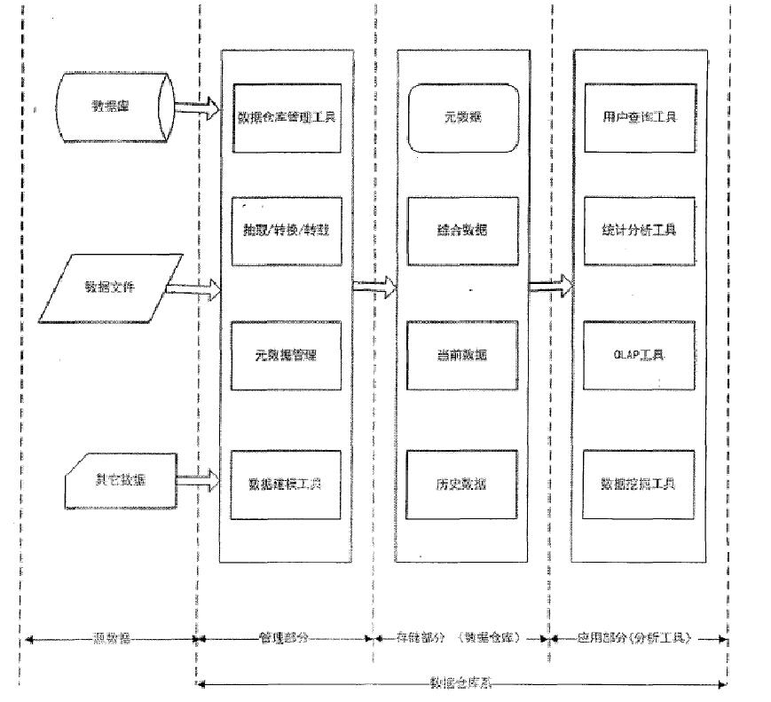

# 20190628 PowerBI & 金融数据仓库中ETL的设计与实现

# 数仓建模工具 Power BI Desktop
[Power BI Desktop 下载](https://powerbi.microsoft.com/en-us/get-started/)

#### 参考资料:
[小新Power BI](https://study.163.com/course/introduction/1004952006.htm)

#### 建模过程

数据获取  建立模型   生成可视化  发布共享

#### 维度表 vs 事实表
所有的关系都是一对多，一端是维度表，多端是事实表

每个维度表实际上是对事实表的一种分类方式

# 金融数据仓库中ETL的设计与实现

## 数据仓库(DW)

>>

数据仓库特征

1. 面向主题的

2. 集成的  
	通常,构造数据仓库是将多个异种数据源如关系数据库、一般文件和联机事务处理记录集成在一起。使用数据清理和数据集成技术,确保命名约定、编码结构和属性度量等指标的一致性。对源数据的集成是数据仓库建设中最关键,也是最复杂的一步。

3. 非易失的  存放长期数据

4. 时变的	

	数据仓库随时间变化不断增加新的数据内容数据仓库随时间变化不断删去旧的数据内容数据仓库中包含有大量的综合数据
>>

##### 数据仓库体系结构

1、源数据

数据仓库随时间变化不断增加新的数据内容数据仓库随时间变化不断删去旧的数据内容数据仓库中包含有大量的综合数据

2、管理部分
元数据是数据仓库本身信息的描述

3、存储部分

4、应用部分

定制多种企业报表既可以做对描述性的OLAP分析

##### 元数据（Metadata）
元数据是关于数据的数据

技术元数据是关于数据仓库系统技术细节的元数据,它主要包括数据的逻辑模型禾物理模型数据仓库中的表名、字段名等属性数据仓库与数据源之间的对应关系和相应的转换规则在线分析处理所用到的维和汇总数据用户及安全管理等等。技术元数据的使用对象是数据库管理员和开发数据仓库系统的工作人员

业务元数据是为了保证用户能够正确、方便地使用数据仓库系统,主要用来提供系统和最终用户之间的语义层,包括最终用户的业务术语所表达的数据模型、对象名和属性名访问数据的原则和数据的来源面向主体的分析模型、方法、公式报表信息等等。业务元数据的使用对象是最终的用户

## 决策支持系统 (DDS)

DDS Decision Support System 

## 金融数据仓库需求分析

#### 金融数据的特点
1、 金融数据的核心是时间、数字以及文本类型的数据
	ETL 过程需要统一数据格式
	分两种数字类型，单价格类型，双价格类型（买入价、卖出加）
	
2、 金融数据的主要表现形式为报表

3、同种类的金融数据，器报表格式及内容相对一致，而不同种类的金融数据,其报表格式和内容却大相径庭

例如股票单笔交易报表,需要提供股票代码,买入价格,买入时间。而货币汇率报表则要提供货币名称,交易货币名称,当前买入价格,当前卖出价格,当前时间等信息。同时因为都是报表格式,所以还都是以行和列来表示数据的,每一行都表示不同的交易行为,而每一行中用不同的列来表示一个交易行为中的各种数据。

4、数据量大。 
同一时间,即使是一个行业内的金融数据的产生都是巨大的,而且金融业还非常注重历史数据,所以任何一个金融行业都保存有海量的数据。这就要求过程能够快速响应数据变化,将更新的数据及时存储到数据仓库中,这样才能为实时数据分析提供保障。

5、各个金融数据之间都有可能有着内在的联系。一个金融数据的产生,很有可能同时影响到看似无关却实际相关的其它几个金融数据的产生。例如,汇率的变化,有很大的可能影响到证券数据。这就要求过程要为每个要存储数据添加标示,来表明此数据是哪种金融数据,以保证后面的数据分析能够有针对性的计算相关数据。

6、添加标示,来表明此数据是哪种金融数据,以保证后面的数据分析能够有针对性的计算相关数据。

#### 实现ETL处理的自动化

第一，能够解析各种不通类型的金融数据

第二，关键数据区能够根据报表格式,将藏于数据区中某几行的某几列关键数据即域数据抽取出来。

第三，域数据抽取出来后,能够根据此数据的类型,如果是双数据的情况下,再次将数据拆分成单数据,并将时间,数字类型信息进行格式统一化。
 
第四，能够为每个要存储数据添加标识,来表明此数据是哪种金融数据。
 
第五，能够对不同种类的交易,应用不同的市场规则,对数据进行再次转换。
 
第六，能够快速的处理数据,保证实时数据的转换。

## ETL系统模块设计

#### 事务处理请求分析模块

#### 系统维护模块
处理维护请求，增删改操作

#### 数据处理模块
信息抽取
	

#### 日志模块
日志记录

## 参考资料
[金融数据仓库中ETL的设计与实现](https://github.com/Morgan-Leon/DataModeling-doc/blob/master/thesis/金融数据仓库中ETL的设计与实现_王淑娜.caj)

