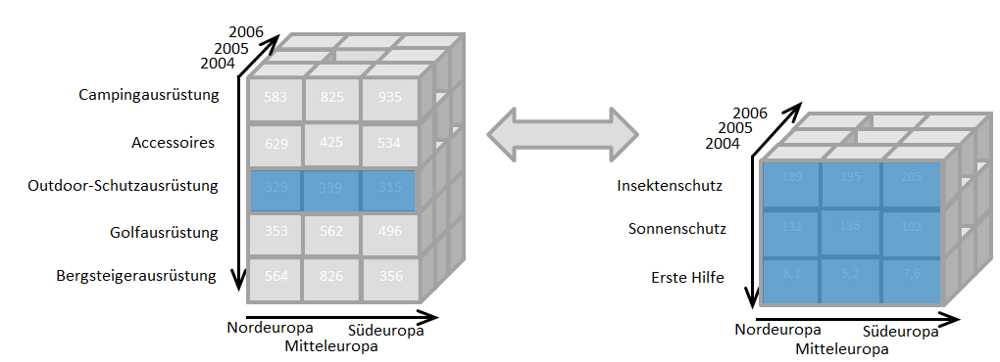
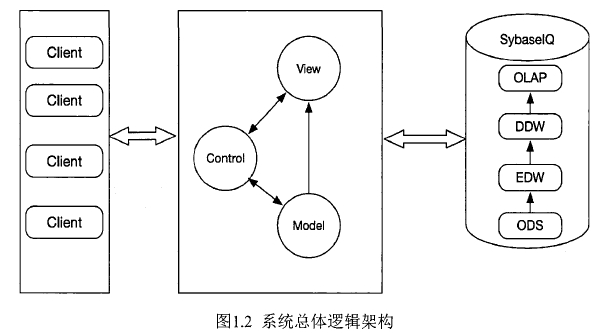
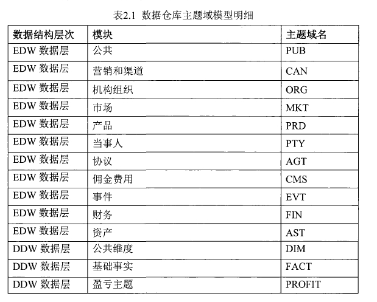
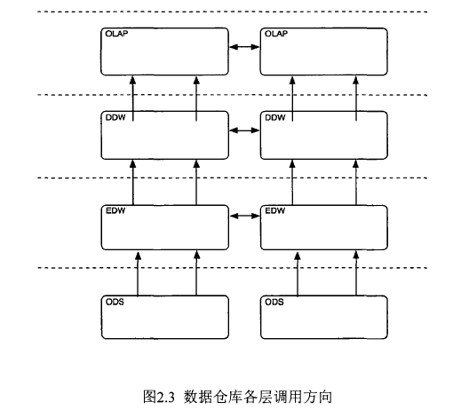

# 20190701 BI && 基于数据仓库的券商业务分析门户的设计与实现

## BI 

#### 商业智能（Business Intelligence,BI）

定义：指用现代数据仓库技术、在线分析处理技术、数据挖掘和数据展现技术进行数据分析以实现商业价值。

核心目标：将数据转化为知识，实现商业利益

技术：ETL、数据仓库、OLAP、数据挖掘、数据展现等技术的综合运用。

#### 在线分析处理（On-Line Analytical Processing，简称OLAP）

是一套以多维度方式分析数据，而能弹性地提供积存（英语：Roll-up）、下钻（英语：Drill-down）、和透视分析（英语：pivot）等操作，呈现集成性决策信息的方法，多用于决策支持系统、商务智能或数据仓库。其主要的功能，在于方便大规模数据分析及统计计算，对决策提供参考和支持。与之相区别的是在线交易处理（OLTP）。

#### 在线交易处理（ Online transaction processing, 简称OLTP）

是指透过信息系统、计算机网络及数据库，以在线交易的方式处理一般即时性的作业数据，和更早期传统数据库系统大量批量的作业方式并不相同。OLTP通常被运用于自动化的数据处理工作，如订单输入、金融业务…等反复性的日常性交易活动。 和其相对的是属于决策分析层次的在线分析处理（OLAP）。

#### 参考资料

[商业智能](https://zh.wikipedia.org/zh-cn/商业智能)

[在线交易处理](https://zh.wikipedia.org/zh-cn/線上交易處理)

[在线分析处理](https://zh.wikipedia.org/zh-cn/線上分析處理)

----

## 基于数据仓库的券商业务分析门户的设计与实现

#### 数据库分层

将数据进行分层，有清晰数据结构、方便追踪数据血缘、减少重复开发等好处
> 
> ODS（ Operational Data Store ） 操作数据存储层，数据源中的数据，经过抽取、洗净、传输，也就说传说中的 ETL 之后，装入本层。本层的数据，总体上大多是按照源头业务系统的分类方式而分类的。但是，这一层面的数据却不等同于原始数据。在源数据装入这一层时，要进行诸如去噪（例如有一条数据中人的年龄是 300 岁，这种属于异常数据，就需要提前做一些处理）、去重（例如在个人资料表中，同一 ID 却有两条重复数据，在接入的时候需要做一步去重）、字段命名规范等一系列操作。

> DW(Data Warehouse) 数据仓库层
> 包含事实表（EDW）和维度表（DDW）

#### 数据仓库建模设计原则

###### 数据库分层 不允许跨层调用

>箭头为被调用方向，ＯＤＳ层可以被ＥＤＷ层调用，但是ＤＤＷ层不可以调用ＯＤＳ层的表格；

>ＥＤＷ能调用ＯＤＳ层的表格，同时也能够同层调用；ＤＤＷ层只能调用ＥＤＷ层的表格，同时也可以同层调用，但是不可以跨层调用ＯＤＳ层的数据。这样设计最大的好处就是每一层各司其职，ＯＤＳ层只专注从分系统载入的数据规范，而不必要与具体业务相关联；ＥＤＷ层对从ＯＤＳ层上来的数据进行清洗，专注业务，把不必要存在的字段去除，对己有的字段数据进行整合，去除数据问题；进行映射（与仓库中的己有字段命名规范，字段的类型还有字典表进行统一）。

>ＤＤＷ层专注维度集成和业务汇总，可以调用ＥＤＷ层和ＤＤＷ层其他维度的表格。

>ＯＬＡＰ层（数据集市层）这一层是提供给外部应用调用结果表的接口层，可Ｗ调用ＤＤＷ层和ＳＪＦＷ层其他表格。通过这样的设计使得数据仓库数据层次分明，在离线运行时避免了调用错误Ｗ及多次计算运行，Ｗ至于过多消耗系统资源的情况。
>
>
>

## 参考资料

[如何优雅地设计数据分层](https://www.kancloud.cn/grass1314521/data_warehouse_in_action/490402)

