# 基于数据仓库的券商业务分析门户的设计与实现(续)

## 功能性需求

#### 分析门户

管理驾驶舱 ： 开户查询、销户查询、资产查询、公司总成交额查询、负债查询，佣金查询；

营业部分析查询 : 将将营业部的盈亏与客户数量等数据利用雷达图盈示到界面，并且提供明细数据

提供客户维度，资金帐号维度，营业部维度，分公司维度进行查询，并且可以进行维度筛选，进行多维分析；

提供公司盈亏与客户分布分析。

## 非功能性需求

#### 数据仓库建模

建模上需要能够在Ｔ＋１或者Ｔ＋０的情况下应对各种业务的不同需求

维度建设上要能够使得新的业务需求更容易进行开发，达到快速应对变更的效果

## 系统总体结构

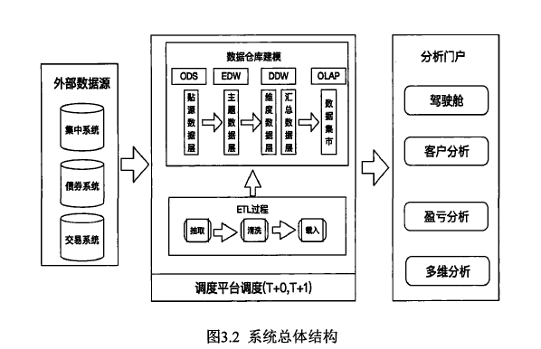

ＯＤＳ层都是由ＥＴＬ进来的数据贴源层，也是最接近于分系统源库的数据层；
ＥＤＷ层经过数据再清洗聚合至ＥＤＷ的主题模型层；
ＤＤＷ层的维度数据层中包括了时间维度，客户维度，营业部分公司维度等各种维度表格

ＯＬＡＰ层的数据集市，在这一层中目前存储一些聚合度非常高的指标数据，比如客户开户数，客户盈亏等等。

## 实体图

#### EDW层

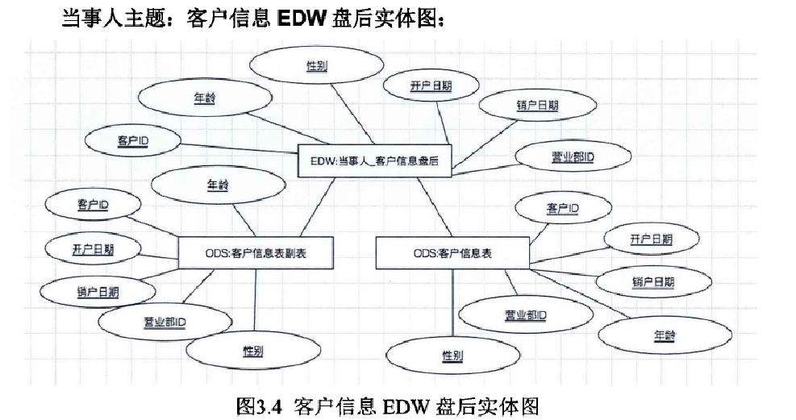

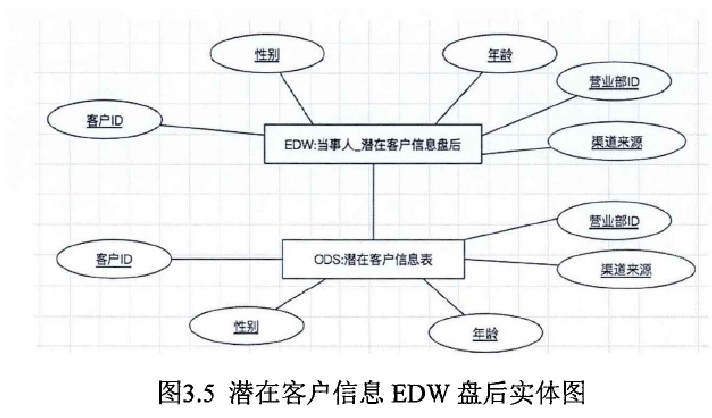

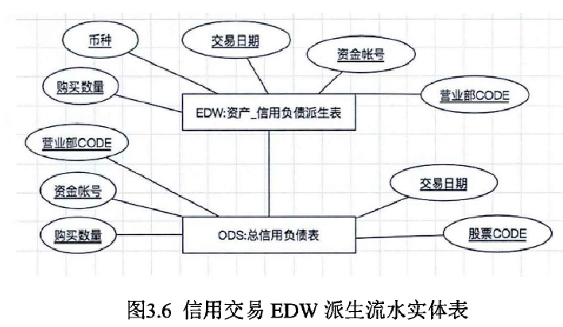

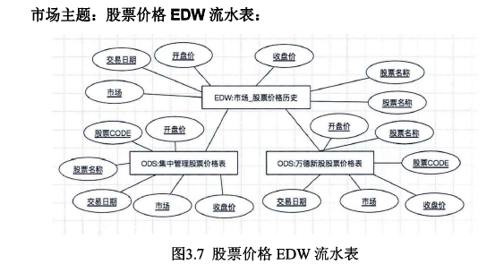

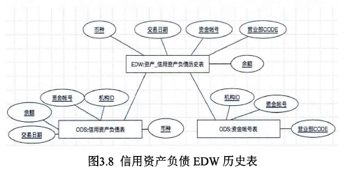

#### DDW层

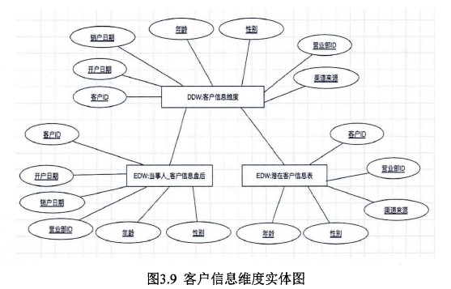

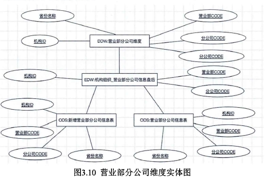

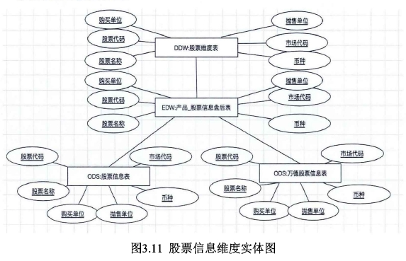

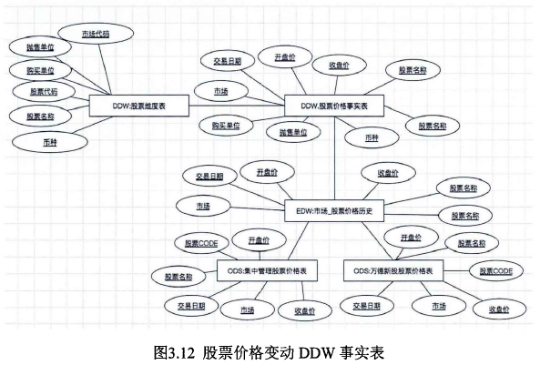

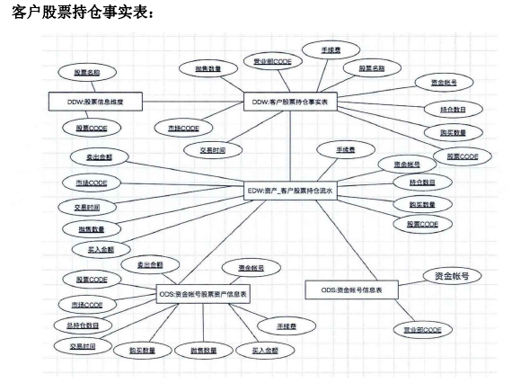

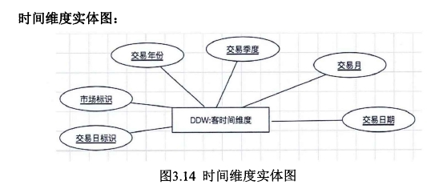

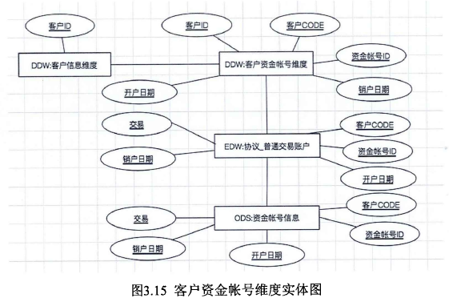

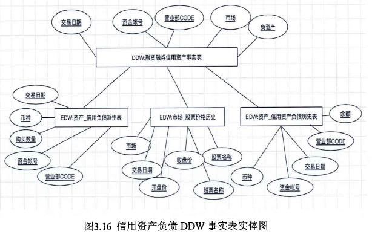

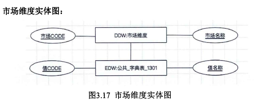

#### OLAP层

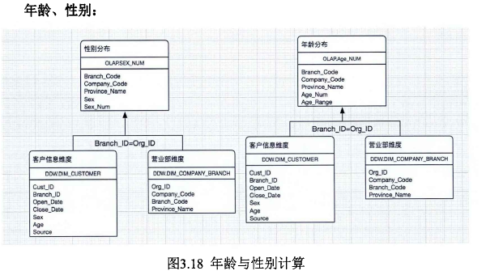

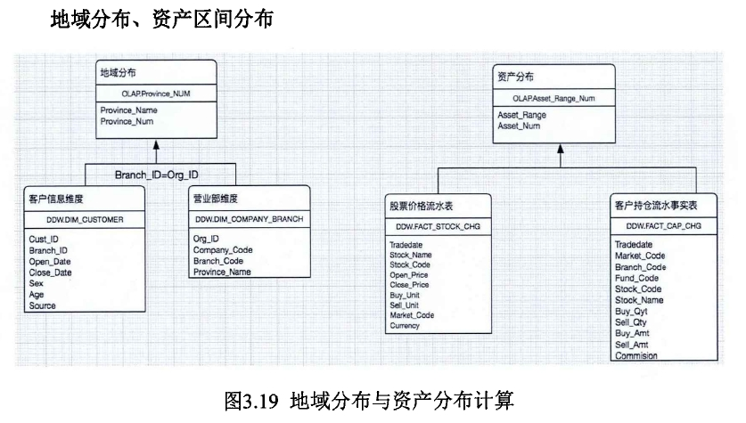

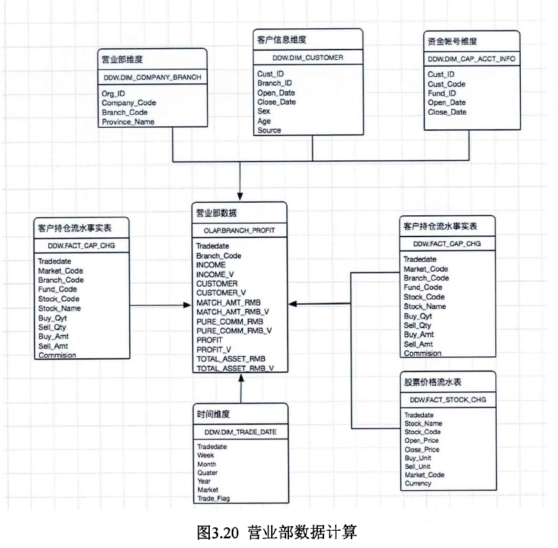

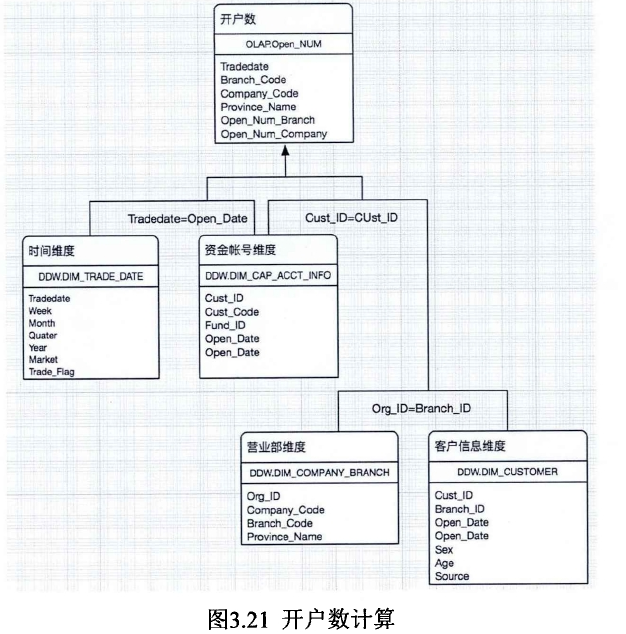

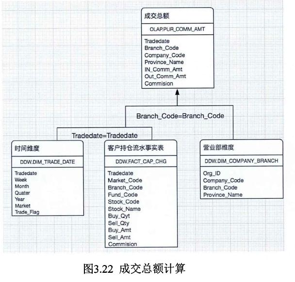

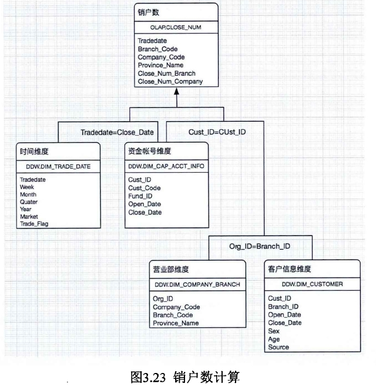

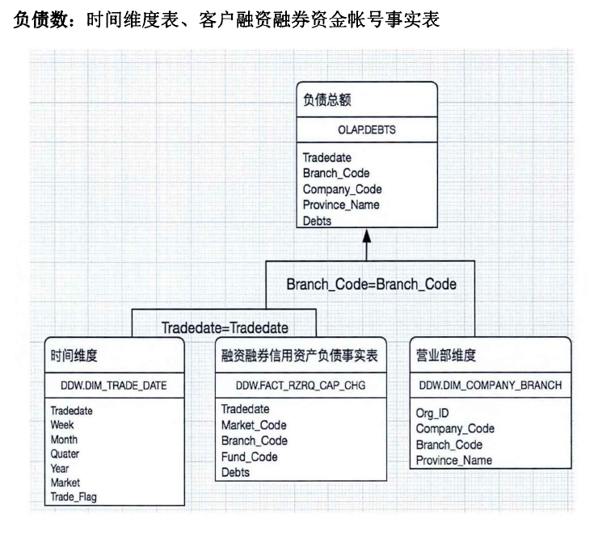

## 参考资料

[基于数据仓库的券商业务分析门户的设计与实现_崔荣进](https://github.com/Morgan-Leon/DataModeling-doc/blob/master/thesis/基于数据仓库的券商业务分析门户的设计与实现_崔荣进.caj)
