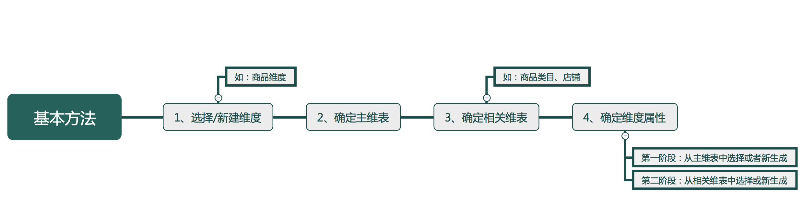

# 大数据分析基础 —— 维度模型

## 维度

维度是维度建模的基础和灵魂。在维度建模中，将度量称为“事实” ， 将环境描述为“维度”，维度是用于分析事实所需要的多样环境。例如， 在分析交易过程时，可以通过买家、卖家、商品和时间等维度描述交易发生的环境。
维度所包含的表示维度的列，称为维度属性。维度属性是查询约束条件、分组和报表标签生成的基本来源，是数据易用性的关键。

#### 事实表

事实表作为数据仓库维度建模的核心，紧紧围绕着业务过程来设计，通过获取描述业务过程的度量来表达业务过程，包含了引用的维度和与业务过程有关的度量。

相对维度来说，通常事实表要细长，行的增加速度也比维度表快的多，维度表正好相反。

事实表有三种类型

1、事务事实表：事务事实表用来描述业务过程，眼踪空间或时间上某点的度量事件，保存的是最原子的数据，也称为“原子事实表\周期快照事实表”。

2、周期快照事实表：周期快照事实表以具有规律性的、可预见的时间间隔记录事实 ，时间间隔如每天、每月、每年等。

3、累积快照事实表：累积快照事实表用来表述过程开始和结束之间的关键步骤事件，覆盖过程的整个生命周期，通常具有多个日期字段来记录关键时间点，当过程随着生命周期不断变化时，记录也会随着过程的变化而被修

#### 度量 / 原子指标
原子指标和度量含义相同，基于某一业务事件行为下的度量，是业务定义中不可 再拆分的指标，具有明确业务含义的名词 ，如支付金额。

#### 维度表与事实表
维度表是事实表不可分割的部分。维度表是进入事实表的入口。丰富的维度属性给出了丰富的分析切割能力。维度给用户提供了使用数据仓库的接口。

#### 维度与指标例子

维度|	指标|	指标|
----|:----:|------:
旧金山|	5,000|	3.74|
柏林|	4,000|	4.55|

## 维度设计
#### 维度基本设计方法

#### 维度的层次结构
维度中的一些描述属性以层次方式或一对多的方式相互关联，可以被理解为包含连续主从关系的属性层次。比如商品类目的最低级别是叶子类目，叶子类目属于二级类目，二级类目属于一级类目。在属性的层次结构中进行钻取是**数据钻取**的方法之一。

#### 范式与反范式
当属性层次被实例化为一系列维度，而不是单一的维度时，被称为**雪花模式**。
大多数联机事务处理系统( OLTP)的底层数据结构在设计时采用此种规范化技术，通过规范化处理将重复属性移至其自身所属的表中，删除冗余数据。
将维度的属性层次合并到单个维度中的操作称为反规范化。分析系统的主要目的是用于数据分析和统计，如何更方便用户进行统计分析决定了分析系统的优劣。采用雪花模式，用户在统计分析的过程中需要大量的关联操作，使用复杂度高，同时查询性能很差;而采用反规范化处 理，则方便、易用且性能好。

#### 交叉探查
数据仓库总线架构的重要基石之一就是一致性维度。在针对不同数据域进行迭代构建或并行构建时，存在很多需求是对于不同数据域的业务过程或者同一数据域的不同业务过程合并在一起观察。比如对于日志数据域，统计了商品维度的最近一天的PV和UV;对于交易数据域，统计了商品维度的最近一天的下单MV。现在将不同数据域的商品的事实合并在一起进行数据探查，如计算转化率等，称为交叉探查。

## 维度拆分

#### 水平拆分

维度通常可以按照类别或类型进行细分。由于维度分类的不同而存在特殊的维度属性，可以通过水平拆分的方式解决此问题。

根据数据模型设计思想，在对维度进行水平拆分时，主要考虑如下两个依据。

维度的不同分类的属性差异情况
业务的关联程度

在设计过程中需要重点考虑以下三个原则。

1、扩展性:当源系统、业务逻辑变化时，能通过较少的成本快速扩展模型，保持核心模型的相对稳定性。软件工程中的高内聚、低稠合的思想是重要的指导方针之一。

2、效能: 在性能和成本方面取得平衡。通过牺牲一定的存储成本， 达到性能和逻辑的优化。

3、易用性:模型可理解性高、访问复杂度低。用户能够方便地从模 型中找到对应的数据表，并能够方便地查询和分析。

#### 垂直拆分

某些维度属性的来源表产出时间较早，而某些维度属性的来源表产出时间较晚;或者某些维度属性的热度高、使用频繁，而某些维度属性的热度低、较少使用;或者某些维度属性经常变化，而某些维度属性比较稳定。在“水平拆分”中提到的模型设计的三个原则同样适合解决此问题。

出于扩展性、产出时间、易用性等方面的考虑，设计主从维度。主维表存放稳定、产出时间早、热度高的属性;从维表存放变化较快、产出时间晚、热度低的属性。

## 参考资料 

[大数据分析基础——维度模型](https://www.jianshu.com/p/58da1060f0f5)