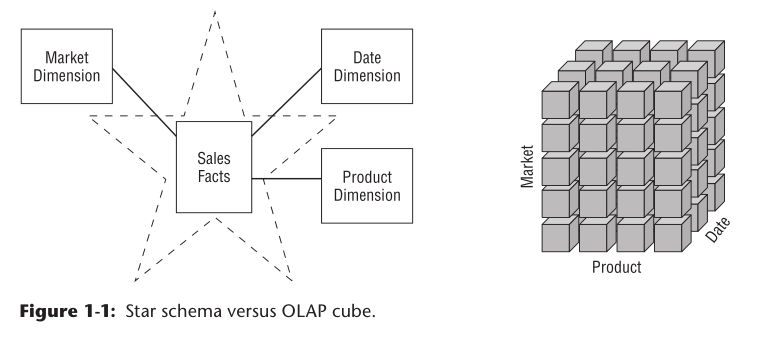

# 20190704 StarSchema和Cube的区别

## Goals of Data Warehousing and Business Intelligence

1、使信息更容易获取
2、数据要保持一致，即便是从多个业务条线中不通数据库中获取的。
3、要能适应变化
4、信息更新要及时
5、要能保证信息安全
6、数据要权威可信
7、要能的到商务认可
> The DW/BI system must make information easily accessible. 
> The DW/BI system must present information consistently.
> The DW/BI system must adapt to change.
> The DW/BI system must present information in a timely way. 
> The DW/BI system must be a secure bastion that protects the information assets.
> The DW/BI system must serve as the authoritative and trustworthy foundation for improved decision making. 
> The business community must accept the DW/BI system to deem it successful.

## DW/BI Manager 经理 
* 理解用户需求
* 发布高质量、相关性强、易获取的信息和分析给行业用户
* 维护DW/BI运行环境

## 为什么要在DW/BI中使用维度模型 Dimensional Modeling

the key difference between 3NF and dimensional models is the degree of normalization.

维度建模和3NF的关键区别在于标准化程度不同。

因为更新、插入等事务操作只涉及到数据库中很少的部分（有限的几张表）。标准化的3NF结构在业务处理（operational processing）中非常有用。但是，规范化模型对于BI查询来说过于复杂。用户无法理解、导航或记忆类似于洛杉矶高速公路系统地图的标准化模型。同样，大多数关系数据库管理系统无法有效地查询规范化模型；用户不可预测的复杂性查询压倒了数据库优化器，导致查询性能下降。在DW/BI的数据展现层中使用3NF建模会破坏直观、高性能的数据检索。幸运的是，维度建模解决了这个问题。

>Normalized 3NF structures are immensely useful in operational processing
because an update or insert transaction touches the database in only one place.
Normalized models, however, are too complicated for BI queries. Users can’t under-
stand, navigate, or remember normalized models that resemble a map of the Los
Angeles freeway system. Likewise, most relational database management systems
can’t efficiently query a normalized model; the complexity of users’ unpredictable
queries overwhelms the database optimizers, resulting in disastrous query perfor-
mance. The use of normalized modeling in the DW/BI presentation area defeats the
intuitive and high-performance retrieval of data. Fortunately, dimensional modeling
addresses the problem of overly complex schemas in the presentation area.
>

## Star Schemas Versus OLAP Cubes

维度模型实现在关系型数据库中 称为star schemas(星型结构)
>Dimensional models implemented in relational database management systems are
referred to as star schemas 

维度模型实现在多维数据库结构中 称为 OLAP cube
>Dimensional models implemented in multidimensional database environments are
referred to as online analytical processing (OLAP) cubes

## 星型模型和Cube的区别
Cube是建立在Star上的，Cube 建立在Star 关系数据库的上层，是Star 的整合

> Star schema is a dimensional modeling technique. It contains, Dimensions and Facts (business measurements). Mostly used in Data warehouse technology.
> Data cube is a multi-dimensional table. It means, combination of dimension and fact tables. Mostly used in OLAP analysis tools.
> Data cubes are built on the star schema to improve the query performance - performing aggregate and summarizing measurements.
> It will pre-calculate the values, instead of calculating on the fly, so it boosts performance.
> Example: Total item, Sales Amount, etc
>