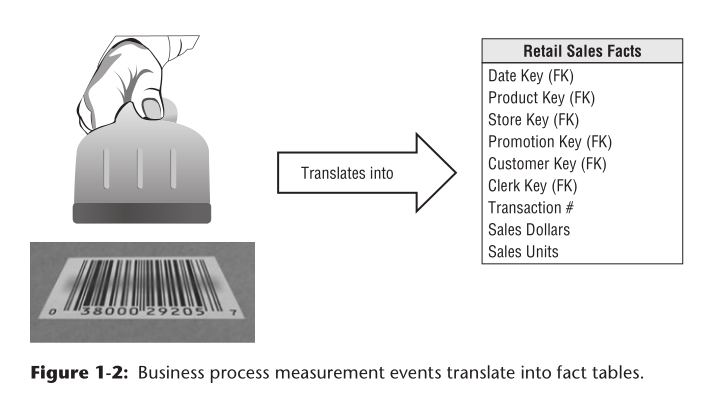

# 20190705 事实表 Fact Tables for Measurements

## 事实表 Fact Tables for Measurements

事实表储存度量数据。因为度量数据在数量上极为巨大，所以应尽量避免此类数据的冗余存储。数仓在建设上，要允许企业中各部门的用户共同访问一个集中存储度量数据的数据库。这样才能保证在整个公司层面数据的一致性。

> measurement data is overwhelmingly the largest set of data, it should not be replicated in multiple places for multiple organizational functions around the enterprise. 

术语“fact” 代表业务度量
> The term fact represents a business measure. 
> Imagine standing in the marketplace
watching products being sold and writing down the unit quantity and dollar sales amount for each product in each sales transaction. These measurements are captured as products are scanned at the register, as illustrated in Figure 1-2.

如下图所示，商场中的商品在购买时经过扫码枪扫描后，此次交易的信息得到了记录。这产生了一个事实，这类信息应记入事实表。

> Each row in a fact table corresponds to a measurement event. The data on each row is at a specific level of detail, referred to as the **grain**,

**grain 谷粒、颗粒**

事实表中的每一行代表了一次交易。这种极为细致的记录，称为数据颗粒

##### 维度建模的核心原则之一是，事实表中的所有测量行都必须处于同一个粒度。
---- 这一原则，可以确保测量值不会被不当地重复计算。

> One of the core tenets of dimensional modeling is that all the measurement rows in a fact table must be at the same grain.

##### 基岩原则（bedrock principle）
每一个测量事件都与事实表中的某一行一一对应
> The idea that a measurement event in the physical world has a one-to-one relationship to a single row in the corresponding fact table is a bedrock principle for dimensional modeling. Everything else builds from this foundation.

---

事实表通常被描述为一个**连续值**，以示其与维度表之区分
> Facts are often described as continuously valued to help sort out what is a fact
versus a dimension attribute.

事实表很深（行数多），但宽度窄（列数少）
>  Fact tables tend to be deep in terms of the number of rows, but narrow in terms of the number of columns.

#####  所有事实表粒度分为三类：事务、定期快照和累积快照。事务粒度是事实表是最常见的。

> all fact table grains fall into one of three categories: transaction, periodic snapshot, and accumulating snapshot. Transaction grain fact tables are the most common.

#### 参照完整性
> All fact tables have two or more foreign keys.
> When all the keys in the fact table correctly match their respective primary keys in the corresponding dimension tables, the tables satisfy **referential integrity**.

#### 复合键
事实表通常有自己的主键，由外键的子集组成。这个键通常被称为复合键。每个具有复合键的表都是事实表。事实表表示多对多关系。其他都是维度表。
> The fact table generally has its own primary key composed of a subset of the foreign keys. This key is often called a composite key. Every table that has a composite key is a fact table. Fact tables express many-to-many relationships. All others are dimension tables.