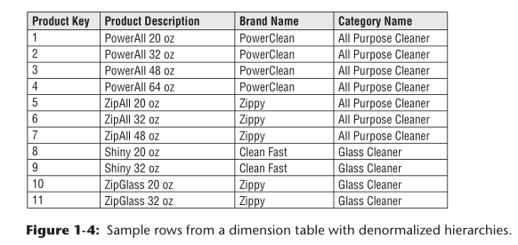

# 维度表 Dimension Tables for Descriptive Context

维度表相对于事实表有较少的行，但是会有很多列
> Dimension tables tend to have fewer rows than fact tables, but can be wide with
many large text columns. 

#### 维度表的属性来自于 “By” word 

维度表的属性是查询条件的主要来源。
维度表的属性来自于 “By” word，例如用户想要按品牌查询美元价格，品牌就应该成为维度表的一个属性

> Dimension attributes serve as the primary source of query constraints, groupings, and report labels. In a query or report request, attributes are identified as the by words. For example, when a user wants to see dollar sales by brand, brand must be available as a dimension attribute.

#### 维度表使DW/BI系统易于理解 dimension attributes are critical to making the DW/BI system usable and understandable.

维度表中的属性应该尽量使用有意义的单词，而不是晦涩的简写。也应该尽量减少在维度表中使用代码，将它们替换为更详细的文本描述。

> Attributes should consist of real words rather than cryptic abbreviations. You should strive to minimize the use of codes in dimension tables by replacing them with more verbose textual attributes.  

#### 操作码有时有特殊意义，这时不如直接将有意义的字段提取出来作为一个新的列

操作码有时有特殊意义
例如，前两个数字代表业务条线，后两位代表所属地区。与其让用户进行拆分字符串的过滤查询，不如将其提取出来作为一个新属性

> Operational codes sometimes have intelligence embedded in them. For example, the first two digits may identify the line of business, whereas the next two digits may identify the global region. Rather than forcing users to interrogate or filter on substrings within the operational codes, pull out the embedded meanings and present them to users as separate dimension attributes that can easily be filtered, grouped, or reported.

#### 强大的维度属性提供强大的分析切片功能

在很多情况写，数仓的分析能力与维度属性的质量和深度成正比。

*  verbose business terminology 详尽的业务术语
*  populating the domain values 填充阈值
*  ensuring the quality of the values 确保取值质量

> In many ways, the data warehouse is only as good as the dimension attributes;
> the analytic power of the DW/BI environment is directly proportional to the quality and depth of the dimension attributes.
> The more time spent providing attributes with verbose business terminology, the better. The more time spent populating the domain values in an attribute column, the better. The more time spent ensuring the quality of the values in an attribute column, the better. 
> Robust dimension attributes deliver robust analytic slicing-and-dicing capabilities

#### 如何确定某个数据属性应属于维度表还是事实表

连续的观测数据几乎总是事实；
从一个小列表中提取的离散值几乎总是维度属性。

> The designer’s dilemma of whether a numeric quantity is a fact or a dimension attribute is rarely a difficult decision. 
> Continuously valued numeric observations are almost always facts; 
> discrete numeric observations drawn from a small list are almost always dimension attributes.

> For example, the standard cost for a product seems like a constant attribute of the product but may be changed so often that you decide it is more like a measured fact. Occasionally, you can’t be certain of the classification; it is possible to model the data element either way (or both ways) as a matter of the designer’s prerogative.

#### 维度表经常会用来表示继承关系 represent hierarchical relationships

如下图所示，有很多维度表会存有包含继承关系的数据。
这会使维度表产生大量冗余数据。你需要尽量克制可能来自于习惯的正规化数据（降雪snowflaking）的冲动。

> You should resist the perhaps habitual
urge to normalize data by storing only the brand code in the product dimension and creating a separate brand lookup table, and likewise for the category description in a separate category lookup table. This normalization is called **snowflaking**. 

相较与第三范式的数据库，维度表会很“非正规化”。它会存有大量的多对一关系的扁平数据。
因为维度表通常在几何空间上比事实表小，所以通过规范化或降雪提高存储效率实际上对整个数据库大小没有影响。为了简单和可访问性，您几乎总是需要牺牲存储空间。
> Instead of third normal form, dimension tables typically are highly denormalized with flattened many-to-one relationships within a single dimension table. Because dimension tables typically are geometrically smaller than fact tables, improving storage efficiency by normalizing or snowfl aking has virtually no impact on the overall database size. You should almost always trade off dimension table space for simplicity and accessibility.

