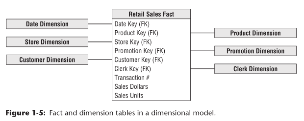

# 星型图1 Star Schema

#### 简单性和等效性 simplicity and symmetry  

减少表的数量并使用有意义的商业术语会使数仓已于检索并减少犯错的机率

> Furthermore, the reduced number of tables and use of meaningful business descriptors make it easy to navigate and less likely that mistakes will occur.

Database optimizers process these simple schemas with fewer joins more effi ciently. A database engine can make strong assumptions about fi rst constraining the heavily indexed dimension tables, and then attacking the fact table all at once with the Cartesian product of the dimension table keys satisfying the user’s constraints. Amazingly, using this approach, the optimizer can evaluate arbitrary n-way joins to a fact table in a single pass through the fact table’s index.

维度模型的**简单**性有助于提高性能。
数据库优化器处理这些简单的模式时使用较少的连接，效率更高。
数据库引擎可以对强索引维度表进行假设，然后使用满足用户约束的维度表键的笛卡尔积同时在事实表中检索。

> The simplicity of a dimensional model also has performance benefits. 
> Database optimizers process these simple schemas with fewer joins more efficiently. 
> A database engine can make strong assumptions about first constraining the heavily indexed dimension tables, and then attacking the fact table all at once with the Cartesian product of the dimension table keys satisfying the user’s constraints. 
> Amazingly, using this approach, the optimizer can evaluate arbitrary n-way joins to a fact table in a single pass through the fact table’s index.

维度模型的可预测框架能够承受用户行为中的意外变化。
每个维度都是**等效**的；所有维度都是事实表中对称相等的入口点。
> The predictable framework of a dimensional model withstands unexpected changes in user behavior. 
> Every dimension is equivalent; all dimensions are symmetrically-
equal entry points into the fact table. 

the most granular or atomic data has the most dimensionality