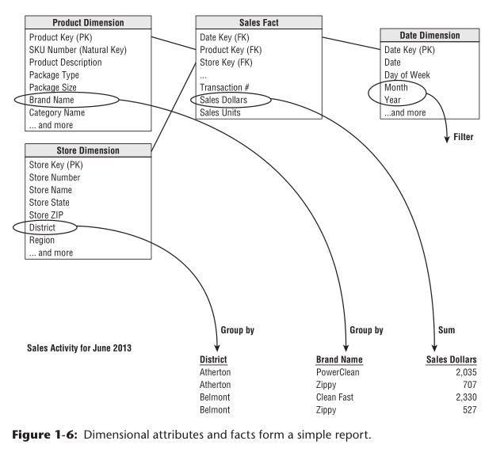

# 星型图2 Star Schema

### 星型图的高扩展性
数据的原子性（粒度）越强其维度也越高。这些原子数据是事实表抵御用户各类意想不到查询的基石。对于维度模型，只要为每个现有事实行定义了该维度的单个值，就可以向模式添加完全新的维度。
同样，若新事实各属性与现有事实表一致，可以将新事实添加到事实表中。也可以使用新属性来补充以前的维度表。
可以通过在表中添加新的数据行或执行sql alter table命令就地更改现有表。数据不需要重新加载，现有的BI应用程序将继续运行而不会产生不同的结果。在第3章中，我们更全面地研究了维度模型的这种优雅的可扩展性。

> This book illustrates repeatedly that the most granular or atomic data has the most dimensionality. Atomic data that has not been aggregated is the most expressive data; this atomic data should be the foundation for every fact table design to withstand business users’ ad hoc attacks in which they pose unexpected queries.
> With dimensional models, you can add completely new dimensions to the schema as long as a single value of that dimension is defi ned for each existing fact row.Likewise, you can add new facts to the fact table, assuming that the level of detail is consistent with the existing fact table. You can supplement preexisting dimension tables with new, unanticipated attributes. 
> In each case, existing tables can be changed in place either by simply adding new data rows in the table or by executing an SQL ALTER TABLE command. Data would not need to be reloaded, and existing BI applications would continue to run without yielding diff erent results. We examine this graceful extensibility of dimensional models more fully in Chapter 3.



```
SELECT store.district_name,
       product.brand,
       sum(sales_facts.sales_dollars) AS "Sales Dollars"
  FROM store, product, date, sales_facts
 WHERE date.month_name = "January"
   AND date.year = 2013
   AND store.store_key = sales_facts.store_key
   AND product.product_key = sales_facts.product_key
   AND date.date_key = sales_facts.date_key
 GROUP BY store.district_name, product.brand

```

如果逐行研究此代码段，select语句下的前两行标识报表中的维度属性，然后是事实表中的聚合度量。FROM子句标识查询中涉及的所有表。WHERE子句中的前两行声明报表的筛选器，其余两行声明维度和事实数据表之间的联接。最后，group by子句在报告中建立聚合。


