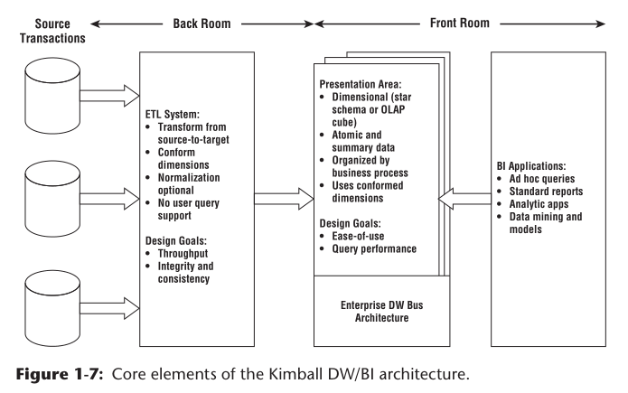

# Kimball’s DW/BI Architecture ———— The source systems

### 架构的四个组成部分

业务资源
ETL
数据展示
BI应用

> there are four separate and distinct components to consider in the DW/BI environment: operational source systems, ETL system, data presentation area, and business intelligence applications.

###  资源系统 The source systems 

The source systems 最重要的功能是为系统提供执行性能和可用性保障

> The main priorities of the source systems are processing performance and availability.

针对资源系统的业务查询是简单直接的（一次一个记录的窄查询），对操作系统资源的需求被严格控制
> Operational queries against source systems are narrow, one-record-at-a-time queries that are part of the normal transaction flow and severely restricted in their demands on the operational system. 

也就是说，不像DW/BI 系统通常的做法，对资源系统的查询并不是无限制的及难于预测的。
> It is safe to assume that source systems are not queried in the broad and unexpected ways that DW/BI systems typically are queried.

资源系统很少维护历史数据
> Source systems maintain little historical data;a good data warehouse can relieve the source systems of much of the responsibility for representing the past.

在许多情况下，资i源系统是一个有专有用途的应用程序，不与组织中的其他操作系统共享公共数据，如产品、客户、地理位置或日历。

> In many cases, the source systems are special purpose applications without any commitment to sharing common data such as product, customer, geography, or calendar with other operational systems in the organization. 

当然，广泛采用的交叉应用企业资源规划（ERP）系统或运营主数据管理系统可以帮助解决这个缺点。
> Of course, a broadly adopted cross-application
enterprise resource planning (ERP) system or operational master data management system could help address these shortcomings.
