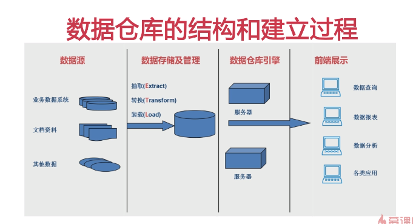

#sdaw

## 数据仓库

> 数据仓库是面向主题的
> 数据仓库是一个集成的数据库
> 数据仓库中的数据是不可更新的

#### 结构

数据源  数据存储及管理（ETL） 数据仓库引擎 前端展示

#### OLTP应用与OLAP应用
OLTP 面向事务

OLAP Online analyses 面向查询 

#### 数据仓库中的数据模型
星型模型 雪花模型

## HIVE 
** HIVE 是建立在Hadoop HDFS 上的数据仓库 ** 
