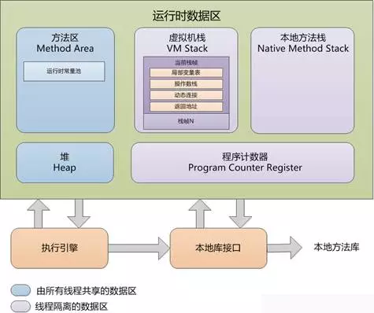

# 20190813_JVM_快排时间复杂度_Hashmap_依赖注入

## 依赖注入

依赖注入（DI）和控制反转（IOC）基本是一个意思，因为说起来谁都离不开谁。简单来说，a依赖b，但a不控制b的创建和销毁，仅使用b，那么b的控制权交给a之外处理，这叫控制反转（IOC），而a要依赖b，必然要使用b的instance，那么通过a的接口，把b传入；通过a的构造，把b传入；通过设置a的属性，把b传入；这个过程叫依赖注入（DI）。

如果一个类A 的功能实现需要借助于类B，那么就称类B是类A的依赖，如果在类A的内部去实例化类B，那么两者之间会出现较高的耦合，一旦类B出现了问题，类A也需要进行改造，如果这样的情况较多，每个类之间都有很多依赖，那么就会出现牵一发而动全身的情况，程序会极难维护，并且很容易出现问题。要解决这个问题，就要把A类对B类的控制权抽离出来，交给一个第三方去做，把控制权反转给第三方，就称作控制反转（IOC Inversion Of Control）。控制反转是一种思想，是能够解决问题的一种可能的结果，而依赖注入（Dependency Injection）就是其最典型的实现方法。由第三方（我们称作IOC容器）来控制依赖，把他通过构造函数、属性或者工厂模式等方法，注入到类A内，这样就极大程度的对类A和类B进行了解耦。

[浅谈控制反转与依赖注入](https://zhuanlan.zhihu.com/p/33492169)

1) 通过构造函数
2) 通过set方法给属性注入值
3) p名称空间
4) 自动装配(了解)
5) 注解

[Spring【依赖注入】就是这么简单](https://juejin.im/post/5aa89d076fb9a028c06a846c)

#### 依赖注入原理
UserService 创建时还需要创建UserDao，这样即产生了依赖（强耦合）。 一旦UserDao产生了变化，UserService也要进行变动。
##### 对象之间的依赖关系，其实就是给对象上的属性赋值！因为对象上有其他对象的变量，因此存在了依赖!
```
class  UserService{
	UserDao userDao = new UserDao();
}
```

```

public class DaoFactory {

    private static final DaoFactory factory = new DaoFactory();
    private DaoFactory(){}

    public static DaoFactory getInstance(){
        return factory;
    }

    public <T> T createDao(String className,Class<T> clazz){
        try{
            T t = (T) Class.forName(className).newInstance();
            return t;
        }catch (Exception e) {
            throw new RuntimeException(e);
        }
    }

}

```

```
    private CategoryDao categoryDao = DaoFactory.getInstance().createDao("zhongfucheng.dao.impl.CategoryDAOImpl", CategoryDao.class);

    private BookDao bookDao = DaoFactory.getInstance().createDao("zhongfucheng.dao.impl.BookDaoImpl", BookDao.class);

    private UserDao userDao = DaoFactory.getInstance().createDao("zhongfucheng.dao.impl.UserDaoImpl", UserDao.class);

    private OrderDao orderDao = DaoFactory.getInstance().createDao("zhongfucheng.dao.impl.OrderDaoImpl", OrderDao.class);


```
## JVM GC 
#### 作用
    JVM 调优
#### 原理
    1、采用分代式GC策略
    2、分为 新生代 老生代 持久代
    3、新生代又分为三个区 Eden区 和两个Survivous区即 S01 S02
    4、针对不同的代有不同的垃圾回收机制，即Minor GC & Full GC 
    5、Minor GC 的触发条件是Eden区满了
    6、Minor GC 会把不用的对象删掉 剩下的放到S01中 S01放不下 会放到Old中，然后Eden区域清空掉
    7、再一次Minor GC 会将新Eden 和 S01 中剩下的没被删掉的对象放到S02中。放不下的扔到OLD中
    8、第三次Minor GC 、第四次依次类推，在S01 S02 连续周转超过15次(有参数可调)的对象也会被放到OLD中
    9、若OLD中剩余的空间放不下Minor GC 多余的对象，则启动Full GC。
#### 关键点
    1、分代式GC策略
    2、可达性分析算法 ，当一个对象到 GC Roots 没有任何引用链相连时（即从 GC Roots 节点到该节点不可达），则证明该对象是不可用的, 说白了就是看对象还有没有被引用
    3、永久代存放应用程序所需的元数据
    4、完全垃圾收集后，若Survivor及old区仍然无法存放从Eden复制过来的部分对象，导致JVM无法在Eden区为新对象创建内存区域，则出现"Out of memory错误"； 

#### JVM 运行时内存
内存分为堆和栈，堆是线程共享的，栈是线程不共享的，栈是运行时的单位，而堆是存储的单位。堆中存的是对象。栈中存的是基本数据类型和堆中对象的引用。
 
    

#### 参考资料
[JVM 调优总结](https://www.cnblogs.com/andy-zhou/p/5327288.html#_caption_12)

[咱们从头到尾说一次 Java 垃圾回收](https://www.infoq.cn/article/ZOYqRI4c-BFKmUBmzmKN)
[JVM GC原理](https://www.cnblogs.com/yy3b2007com/p/10975870.html)
[JVM运行时区域详解。](https://mp.weixin.qq.com/s?__biz=MzI3ODcxMzQzMw==&mid=2247484701&idx=1&sn=db752b494c7ca0baafc0df795343ee9d&chksm=eb53802bdc24093dd76ea3e3047a9bea61c8dc9370724924083525c68d083d3ccf1798295f5f&scene=21#wechat_redirect)
## 快排时间复杂度


nlog(n)
[](https://www.zhihu.com/question/22393997)
## Hashmap的原理

## SQL优化